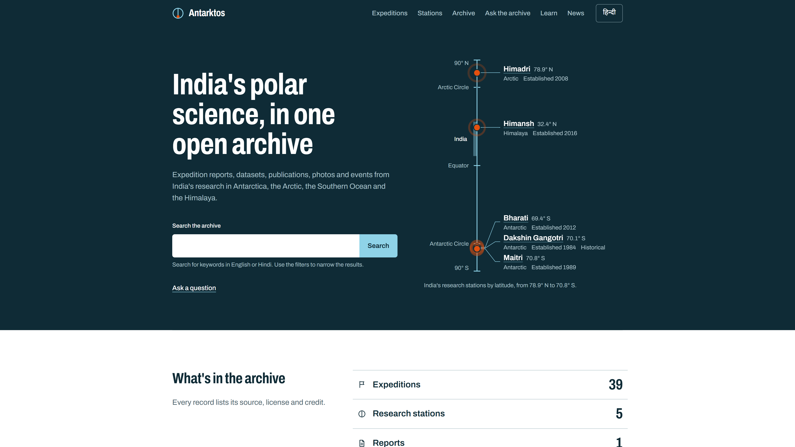
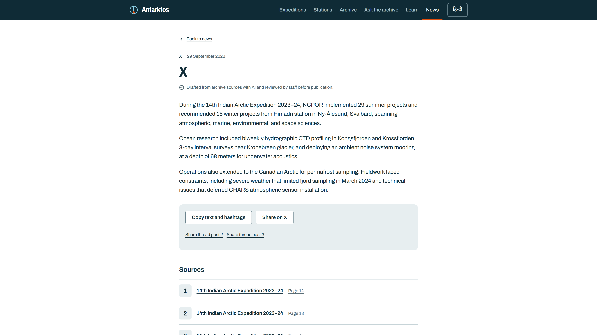
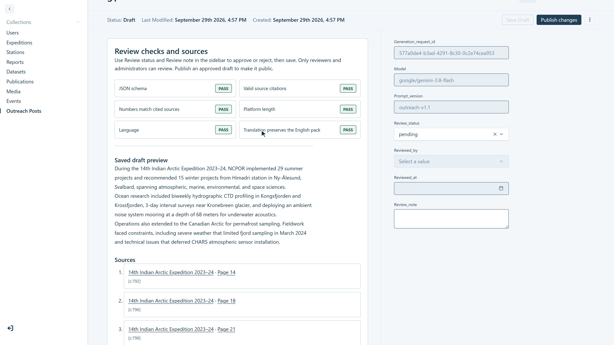
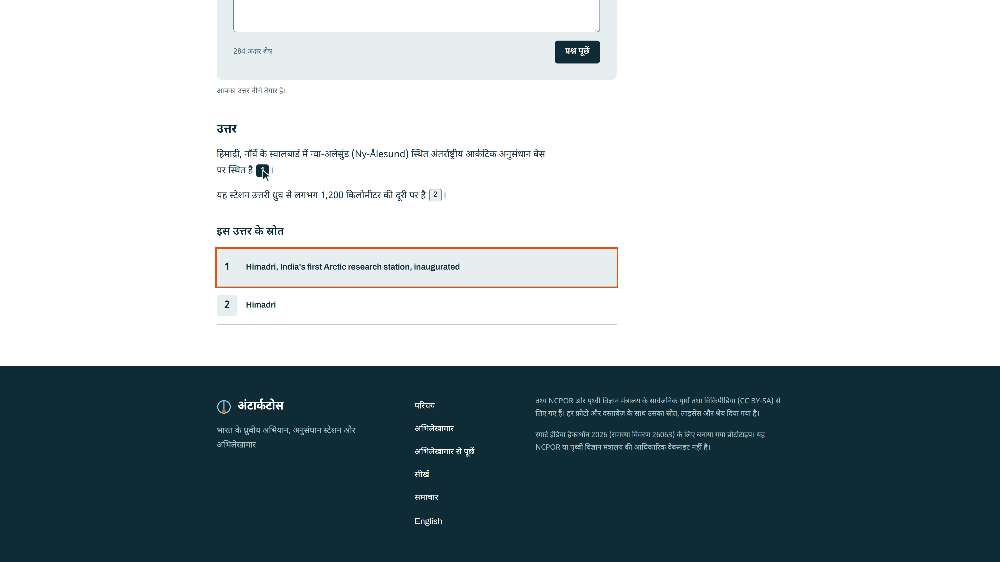

# Antarktos

**Integrated Polar Science Outreach, Knowledge Repository and Media Dissemination Portal**
Smart India Hackathon 2026 · Problem statement 26063 (Ministry of Earth Sciences / NCPOR)

**Live:** https://antarktos.vercel.app · **Hindi:** https://antarktos.vercel.app/hi



## The problem

India has four decades of polar research: expedition reports, datasets, publications, photographs and institutional events from Antarctica, the Arctic, the Southern Ocean and the Himalaya. That material is spread across PDFs and web pages. It is hard for the public to find, and turning it into outreach content (articles, social posts, press notes, school material) is slow manual work.

## What Antarktos does

1. **Archives** expeditions, stations, reports, datasets, publications, photos, videos and events, each with its source, license and credit.
2. **Reads** every uploaded PDF: extracts the text page by page, indexes it for search, and writes a short summary where every sentence links to the page it came from.
3. **Drafts outreach** from any archive record: blog post, X thread, Instagram caption, LinkedIn post, press note, and a student explainer with a quiz, in English and Hindi.
4. **Checks every draft in code** before a person sees it: citations point at real source text, every number appears in a cited source, platform length limits, correct script for the language.
5. **Keeps a human in charge:** nothing AI-written is public until a reviewer approves and publishes it.
6. **Answers questions** from the archive only, with numbered citations, and says "not found" instead of guessing.
7. **Works in English and Hindi** on every public page (`/` and `/hi`).

## Features

| Area | What you can do |
|---|---|
| Archive | Browse and filter by type, region, year, expedition and station; keyword search in English and Hindi |
| Expeditions | Timeline of Indian expeditions grouped by decade; each expedition page gathers its reports, datasets, photos and events |
| Stations | Leaflet map and pole-to-pole latitude view of Maitri, Bharati, Dakshin Gangotri, Himadri and Himansh; each station page lists its expeditions and records |
| Compare | Side-by-side table of two expeditions or two stations, straight from the archive data |
| Ask the archive | Plain-language questions, answered only from published records, with numbered sources that open the PDF at the cited page |
| Learn | Student explainers grouped by topic, each with a five-question quiz |
| News | Approved outreach posts with copy and share buttons, sources, and who approved them and when |
| Datasets | DCAT-style metadata (parameters, time range, bounding box, DOI); CSV files get a preview of the first rows |
| Open data | Read-only JSON API for every public collection (see `/about/api`) |

## Screenshots

| | |
|---|---|
|  |  |
| Published post with its sources | Reviewer checks before approval |
|  | |
| Ask the archive, answering in Hindi | |

## How it works

```text
                     Browser (public visitors and NCPOR staff)
                                      |
        Next.js on Vercel (one deploy) — Payload CMS 3 runs inside the same app
        ├── Public portal  /  and  /hi         (Tailwind, server-rendered)
        ├── Staff admin    /admin              (Payload: roles, drafts, versions)
        └── API routes     /api/*              (Payload REST + search, ask, generate)
                 |                     |                          |
        Neon Postgres          Cloudflare R2                 OpenRouter
        records, versions,     PDFs, photos, video,          text and vision
        archive_chunks         datasets (browser uploads     models (IDs set by
        (full-text search)     straight to R2)               environment variables)
```

### Processing pipeline

```text
Upload (browser → R2) → extract text per PDF page → chunk (a chunk never spans two pages)
  → index in Postgres full-text search (english / hindi) → cited English summary
  → checked Hindi translation → draft saved → reviewer publishes
```

Scanned PDFs with no text layer are flagged `needs_ocr` and never sent to a model. Photos get an AI caption and alt text in both languages, also as drafts.

### Grounding and trust

- The model only sees text from the archive, and is told that text is data, not instructions.
- Every long-form sentence must end with a citation marker for a real source chunk. Sentences without one are dropped in code.
- Every number in a draft must appear in a chunk it cites, or the reviewer sees the check fail.
- Hindi is a checked translation of the English: every citation kept, no new numbers.
- Reviewers see pass/fail checks, never a confidence score.
- Public pages and the public API only return published records. Outreach posts also need reviewer approval.
- Ask the archive is rate-limited per hashed IP and cached, and never answers from general knowledge.

### Cost limits

R2 and the model API bill a real card, so the app enforces its own limits: per-file size caps (PDF 50 MB, image 15 MB, dataset and video 100 MB), an 8 GB storage budget counted from the database, and no model call for records that already have their AI output.

## Tech stack

Next.js 16 (App Router, TypeScript) · Payload CMS 3 · Neon Postgres 18 (`@payloadcms/db-postgres`) · Cloudflare R2 (`@payloadcms/storage-s3`, client uploads) · OpenRouter through the `openai` SDK · Tailwind CSS 4 + shadcn/ui (public site only) · Leaflet · unpdf · Vercel (`sin1`)

No vector database, queue, Redis or separate backend: search and ask-the-archive run on Postgres full-text search.

## Running it locally

Requires Node 20.9+ and a Postgres 18 database (Neon works), an R2 bucket and an OpenRouter key.

```bash
cp .env.example .env    # fill in the values
npm install
npm run payload migrate
npm run seed            # loads data/seed/*.json (stations, expeditions, events) if present
npm run dev
```

Site at http://localhost:3000 (Hindi at `/hi`), admin at http://localhost:3000/admin. The first account you create in the admin is an administrator.

| Variable | Purpose |
|---|---|
| `DATABASE_URL`, `DATABASE_URL_UNPOOLED` | Postgres connection (pooled and direct) |
| `PAYLOAD_SECRET` | Payload auth secret |
| `R2_ACCOUNT_ID`, `R2_ACCESS_KEY_ID`, `R2_SECRET_ACCESS_KEY`, `R2_BUCKET`, `R2_PUBLIC_URL` | File storage |
| `OPENROUTER_API_KEY`, `LLM_MODEL_TEXT`, `LLM_MODEL_VISION` | Model provider and model IDs |
| `APP_BASE_URL` | Public site origin; outreach generation only accepts requests from it |
| `IP_HASH_SALT` | Salt for hashing IPs in the ask-the-archive rate limit |

Useful scripts:

```bash
npm run pipeline:stuck                                  # records stuck in processing
npm run pipeline:process -- --collection reports --id 12  # re-run one record
npm run test:pipeline && npm run test:search            # unit checks, no network
npm run test:e2e                                        # Playwright, against the dev server
```

## Content sources

Demo content comes from public NCPOR and Ministry of Earth Sciences pages and reports, Wikipedia (CC BY-SA) and Wikimedia Commons. Every record shows its source, license and credit.

This is a hackathon prototype. It is not an official NCPOR or Ministry of Earth Sciences website.
